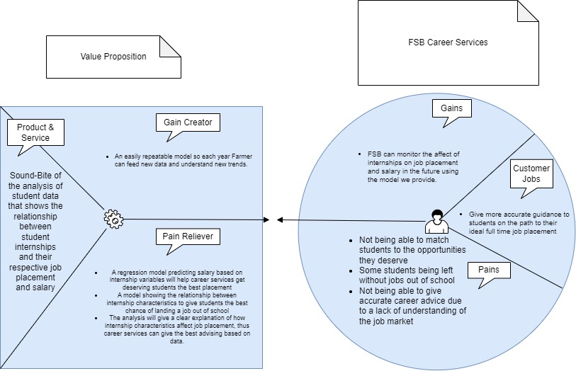

```{r setup, include=FALSE}
knitr::opts_chunk$set(echo = TRUE)
```

## Audience and Purpose
The purpose of this analysis is to provide information on the relationship between number of internships and full time job placement characteristics (salary, preferred location/field) to FSB Career Services. This will help them give more accurate guidance to students to ensure they get the best full time opportunity for them.


## Business Value Proposition



```{r}
pacman::p_load(tidyverse)
fsb <- data


table(fsb$survey_internships)
```

```{r}
table(fsb$survey_state)
```


```{r}
```


```{r}
afj <- fsb[which(fsb$survey_plans == c("accepted fulltime job")),]
se <- fsb[which(fsb$survey_plans == c("seeking employment")),]

fsb3 <- rbind(afj, se)
```

```{r}
fsb

```


